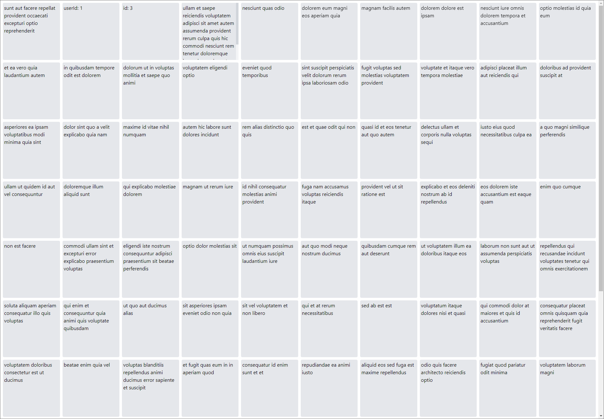

# JSONPlaceholder Visualizer

This Angular application loads all (100) posts from the JSONPlaceholder testing API (https://jsonplaceholder.typicode.com/).

The posts are shown in a 10 x 10 grid with each post in its own square. On load the squares show the title of the post. When clicking on a square, it loops through all its properties: title -> userId -> id -> body -> title -> ...

## Development server

Run `ng serve` for a dev server. Navigate to `http://localhost:4200/`. The application will automatically reload if you change any of the source files.

## Build

Run `ng build` to build the project. The build artifacts will be stored in the `dist/` directory.

## Running unit tests

Run `ng test` to execute the unit tests via [Karma](https://karma-runner.github.io).

## TODO

- Create unit tests for PostsComponent
- Create unit tests for PostsService
- Improve styling
- Responsive design for smaller screens
